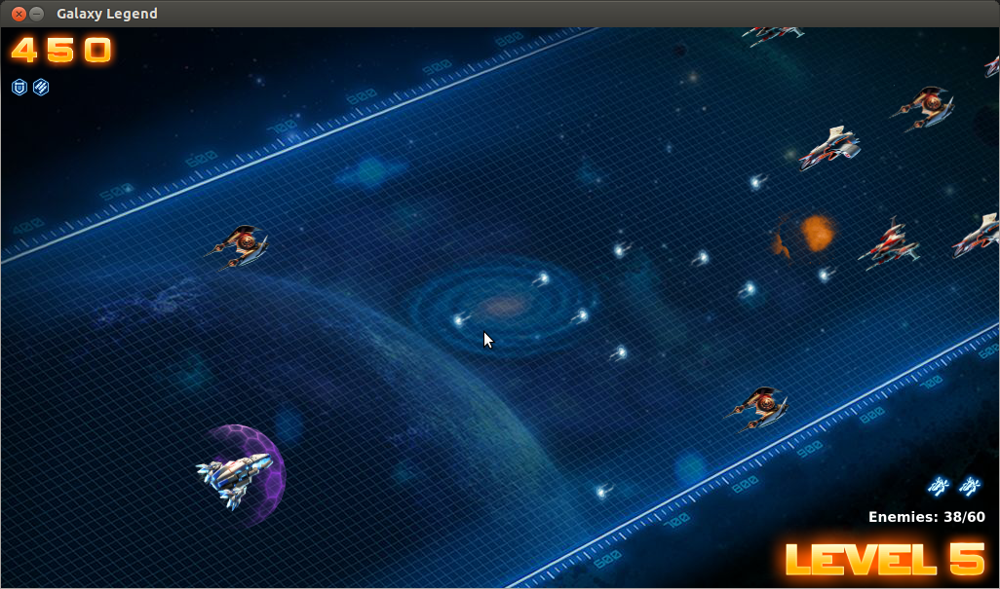

GalaxyLegend
==========

Devastate the enemy and dominate the Galaxy.



####A simple game made in Ruby using [Gosu](http://www.libgosu.org/).

Installation
-----
* Install Ruby 1.9.x
* Install Gosu

  ```ruby
  # Gosu's dependencies
  sudo apt-get install build-essential libsdl2-dev libsdl2-ttf-dev libpango1.0-dev libgl1-mesa-dev libfreeimage-dev libopenal-dev libsndfile-dev

  gem intall gosu
  ```
If you cannot install SDL2 using the command below, download and install from its [homepage](https://www.libsdl.org/index.php).

Run the game
-----
```
ruby GalaxyLegend.rb
```

Play the game
-----
* Use arrow keys `←`, `↑`, `→`, `↓` to nagivate your ship.
* Press `Space` to fire. If your ship is under special attack mode, it can launch 3 missiles simultaneously.
* Press `S` to activate plasma shield, protecting your ship from enemy missiles.
* Press `Enter` to restart the game when it is over.
* Press `Esc` to quit the game.


####Disclaimer
This project is a demonstration of  how to use Gosu to make game in Ruby and is for educational purposes only. All credits of resource (images and audio) go to **[Tap4Fun](http://www.tap4fun.com/)**, the creator of a game with the same name.